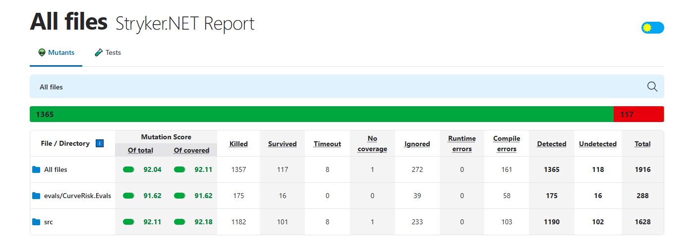

# Curve & Risk

[](https://github.com/paciom/curve_and_risk/actions/workflows/ci.yml)
[](https://github.com/paciom/curve_and_risk/actions/workflows/codeql.yml)
[](https://scorecard.dev/viewer/?uri=github.com/paciom/curve_and_risk)

**AI agents write the code. Engineering makes it trustworthy.**

## ⚡ At a glance

**One engineer. A team of AI agents. A production-shaped pricing and risk platform, with the test evidence to back it.**

| 🧪 99.8% / 98% | 🎯 92% | 🛡️ 0 | 🤖 844 |
|:---:|:---:|:---:|:---:|
| **line / branch coverage**, enforced as a gate | **of 1,483 injected faults caught** by the tests (mutation score), up from a first baseline of 55.6% | **analyzer findings**, and one suppressed rule in the whole codebase, with a budget that blocks a second | **tests**, all offline: 793 .NET, 22 on the agent guard rails and 29 on the loop that directs the agent |
| [📄 coverage report](docs/reports/coverage.md) | [📄 mutation report](docs/reports/mutation.md) | enforced at [build](https://github.com/paciom/curve_and_risk/actions/workflows/ci.yml); scanned by [CodeQL](https://github.com/paciom/curve_and_risk/actions/workflows/codeql.yml) | [📄 test report](docs/reports/coverage.md#tests) |

[](docs/reports/mutation.md)

The reports are snapshots of the latest full local run, committed so they open in one click. Live results are on the [ci](https://github.com/paciom/curve_and_risk/actions/workflows/ci.yml) and [mutation](https://github.com/paciom/curve_and_risk/actions/workflows/mutation.yml) workflow runs. [How each gate works](docs/quality-gates.md).

### AI engineering on show

- 🔁 **Loop engineering.** A [script](tools/mutation-loop/loop.mjs), not a person, directs the coding agent: it picks surviving mutants, prompts the agent, reruns Stryker to check the result itself, keeps or reverts, feeds the finding back, and stops on a target, a spend cap or a stall.
- 🕸️ **Graph engineering.** A [risk brief](src/CurveRisk.Copilot/Briefs/RiskBriefGraph.cs) written as a validated graph on a small [runtime](src/CurveRisk.Workflows): code owns the path, the engine produces every figure, the model writes one checked paragraph, and a write happens only when a person resumes the paused run.
- 🛡️ **A guarded agent runtime.** The product agent is a [125-line loop](src/CurveRisk.Copilot/CopilotAgent.cs) with a call limit, a spend cap, human approval for writes and one bounded self-repair.
- 🔢 **Hallucination control that is code, not a prompt.** The model never originates a number: [every figure in an answer](src/CurveRisk.Copilot/NumericGrounding.cs) must trace to a tool result or the answer is withheld.
- 🧰 **Tool design and MCP.** [One tool catalog](src/CurveRisk.Ai.Tools/ToolCatalog.cs) serves both the in-product Copilot and an [MCP server](src/CurveRisk.Mcp) for external agents. Write tools sit behind an approval gate.
- 📏 **Evals.** A [dataset with deterministic graders](evals/) for the product agent, and a [benchmark](benchmarks/reviewer/) that scores the AI reviewers against planted defects: 12 of 12 found, no false alarms. The graders have tests showing they can fail.
- 🧠 **Context and prompt engineering.** A small always-loaded [`CLAUDE.md`](CLAUDE.md), thirteen on-demand [skills](.claude/skills/), a cache-stable system prompt, and untrusted text kept apart from instructions.
- 👥 **Multi-agent orchestration.** Six [reviewer subagents](.claude/agents/) that start from a clean context, and parallel agents in isolated worktrees: one session took the mutation score from 70% to 92% and surfaced a real bug.
- 🚧 **Guard rails for the coding agent itself.** [Hooks](.claude/hooks/) block edits to expected answers, thresholds and the hooks themselves, and verify the build before the agent may stop.
- 🔌 **Provider-independent and observable.** The SDK lives behind [one interface](src/CurveRisk.Copilot/IModelClient.cs), so the agent is tested offline; spans, token usage and cost are emitted as OpenTelemetry GenAI telemetry.

---

A .NET 10 pricing and risk platform built agent-first, where every rule that matters is enforced by something other than a prompt: a hook, a compiler error, a test, a threshold, or a human approval.

*This page is about the software and AI engineering. The financial domain is in [FINANCE.md](FINANCE.md).*

## What this demonstrates

**Agent skills written as engineering procedures.** Thirteen [skills](.claude/skills/). Six are general: [clean code](.claude/skills/clean-code/SKILL.md), [unit testing](.claude/skills/unit-testing/SKILL.md), [code review](.claude/skills/review-code/SKILL.md), [security review](.claude/skills/review-security/SKILL.md), [refactoring](.claude/skills/refactor-safely/SKILL.md), [debugging](.claude/skills/debug-systematically/SKILL.md). Each step has a check, and each rule carries its reason.

**Context engineering.** A small always-loaded [`CLAUDE.md`](CLAUDE.md), skills that load on demand, [reviewer subagents](.claude/agents/) that start from a clean context so the author cannot anchor them, and a hard line between trusted and untrusted text inside the product's own agent.

**Loop engineering.** A [mutation-kill loop](tools/mutation-loop.mjs) in which a script writes the instruction, the coding agent writes the test, and the script decides whether it counts: only test files may change, the fast gate must pass, and Stryker must report the mutant killed. A rejected attempt is reverted and its reason becomes the next prompt. The agent's own claim of success is never read as a result. [Details](docs/ai-engineering.md#loop-engineering).

**Graph engineering.** Where the Copilot loop lets the model pick each step, the [risk brief](src/CurveRisk.Copilot/Briefs/RiskBriefGraph.cs) is a fixed procedure on a hand-written [graph runtime](src/CurveRisk.Workflows): typed state, declared edges, a parallel fan-out, a bounded repair cycle and a pause for approval. The graph is validated before it can run, every exit is named, and the diagram in the docs and on the web page is generated from the definition that executes. It returns its figures even with no model configured. [Details](docs/ai-engineering.md#graph-engineering), [ADR 0002](docs/adr/0002-graph-workflows.md).

**A guarded agent runtime.** The product's [125-line agent loop](src/CurveRisk.Copilot/CopilotAgent.cs) has a call limit, a spend cap, human approval for writes, verification of every answer and one bounded self-repair. [Hooks](.claude/hooks/) block, format and verify the coding agent's work in every session.

**Prompt engineering, and its limits.** [Prompts](src/CurveRisk.Copilot/Prompts/system.md) that explain why. Then a control outside the prompt for everything that must hold, because a prompt asks and does not enforce.

**Guard rails an agent cannot argue with.** The coding agent is blocked from editing expected answers, thresholds and its own hooks. During this build it tried to change its own stop hook, and the hook refused.

**Measured AI.** An [eval suite](evals/) with deterministic graders for the product agent, and a [benchmark](benchmarks/reviewer/) that scores the AI reviewers against planted defects.

**API design.** [Versioned REST endpoints](src/CurveRisk.Api/Endpoints/ApiEndpoints.cs) with typed [contracts](src/CurveRisk.Contracts/V1/Contracts.cs) on .NET Standard 2.0, idempotent creation, ETag concurrency, a background job resource, RFC 9457 errors, OpenAPI, and EF Core on PostgreSQL.

**Conventional quality engineering underneath.** [One command](tools/check.mjs) runs nine gates locally, at push and in CI. AI review sits on top; it never decides whether a build passes.

## Proof it works

**An AI reviewer broke the AI-written guard rail.** With 88 tests green, an independent reviewer subagent found 16 ways around a safety check and a write path with no approval. Each became a failing test, then a fix.

**Static analysis caught what AI review missed.** Switching the analyzers on found 12 violations in code that had already been AI-reviewed, including a property with cyclomatic complexity 21. All fixed in code, none suppressed.

**The code failed its own standard and was refactored.** The size check flagged an 88-line agent loop. It was split into three small classes with every test green before and after.

**Coverage flattered the tests, and mutation testing said so.** With 96.8% of lines covered, the first mutation run caught only 55.6% of injected faults: tests were executing code without asserting on it. The score is now measured, published and tracked. Survivors were then worked through file by file, each one answered with a test of the behaviour it exposed, and it stands at 92.0%; most of what remains cannot be detected by any test. Writing those tests found a request that returned a 500 where it owed the caller a 409, now fixed. That procedure is now a [script](tools/mutation-loop.mjs) that directs the agent and checks each kill with Stryker.

**An independent reviewer re-derived the numbers.** A reviewer subagent rebuilt the demo curve from scratch in a separate language and matched the pricing library to the cent. It then found two inputs the library would have silently mispriced, a swap already under way and a deposit that had already started. Both are now refused with a clear error, with tests.

**Running it found what the tests could not.** All API tests were green, then the page was opened in a browser and the first click returned a 500: a fresh run had no database tables, because tests created the schema and a real start-up did not. Fixed, with a test for the opposite case.

**A reviewer broke the loop that checks the agent.** With its tests green, an independent reviewer showed that the mutation loop would miss a change the agent had staged or committed, and would count a kill bought by weakening another test. The loop now compares against the last tree it accepted, accepts added tests only, and rejects an attempt that lets a killed mutant survive. Each has a test.

**The reviewers earned their place.** Scored against ten planted defects, both found all of theirs and raised no false alarm. One also found a real bug in a sample that was meant to be clean.

## How quality is enforced

```text
edit      analyzers as compile errors · agent hooks (protect, format)
finish    the agent cannot end a turn on a broken build or failing tests
commit    format · size limits · lint · links · suppression budget
push      + build · tests · coverage (line, branch, per file) · guard-rail and loop tests
PR        + secret scan · CodeQL · SonarQube Cloud · workflow lint · PostgreSQL tests · container build, smoke test and scan
main      + publish the tested image to the container registry · OpenSSF Scorecard
weekly    mutation testing · dependency updates
on demand the mutation-kill loop: a script directs the agent at the surviving mutants
```

```bash
node tools/check.mjs
```

AI review, failure triage and a weekly security sweep run locally in Claude Code today. The same steps exist as [workflows](.github/workflows/) and switch on with an API key. They advise; they never block a merge.

## Start here

| To see | Open |
|---|---|
| A skill file | [`clean-code/SKILL.md`](.claude/skills/clean-code/SKILL.md) |
| The loop that directs the coding agent | [`loop.mjs`](tools/mutation-loop/loop.mjs), [`mutation-loop.test.mjs`](tests/tools/mutation-loop.test.mjs) |
| The product's agent loop | [`CopilotAgent.cs`](src/CurveRisk.Copilot/CopilotAgent.cs) |
| A workflow as a graph | [`RiskBriefGraph.cs`](src/CurveRisk.Copilot/Briefs/RiskBriefGraph.cs), [`GraphRunner.cs`](src/CurveRisk.Workflows/GraphRunner.cs), [`RiskBriefApprovalTests.cs`](tests/CurveRisk.Ai.Tests/Briefs/RiskBriefApprovalTests.cs) |
| The REST API | [`ApiEndpoints.cs`](src/CurveRisk.Api/Endpoints/ApiEndpoints.cs), [`TradeApiTests.cs`](tests/CurveRisk.Api.Tests/TradeApiTests.cs) |
| The pricing library | [`CurveBootstrapper.cs`](src/CurveRisk.Analytics/Curves/CurveBootstrapper.cs), [`FINANCE.md`](FINANCE.md) |
| A guard rail and its tests | [`protect-paths.mjs`](.claude/hooks/protect-paths.mjs), [`protect-paths.test.mjs`](tests/hooks/protect-paths.test.mjs) |
| Tests proving the graders can fail | [`EvalHarnessTests.cs`](tests/CurveRisk.Ai.Tests/EvalHarnessTests.cs) |
| Architecture rules as tests | [`ArchitectureTests.cs`](tests/CurveRisk.Ai.Tests/ArchitectureTests.cs) |
| What went wrong and how it was caught | [`docs/ai-workflow.md`](docs/ai-workflow.md) |
| Every claim, with its file | [`docs/ai-engineering.md`](docs/ai-engineering.md) |
| Every gate and threshold | [`docs/quality-gates.md`](docs/quality-gates.md) |
| The container pipeline | [`container.yml`](.github/workflows/container.yml), [`docs/deployment.md`](docs/deployment.md) |

## Status

Built: the pricing library, a versioned REST API with persistence, a small web page, the AI layer (MCP server, Copilot, a risk brief run as a graph, evals), the agent harness, the mutation-kill loop and the quality pipeline. Run it with `dotnet run --project src/CurveRisk.Api` and open the URL it prints.

[Planned](PLAN.md), not built: database migrations, market-data imports, Aspire orchestration, and the step that deploys the published image to a cloud.

Not yet verified: the product agent has not been run against a live model (no API key yet), so its evals have no baseline; the mutation-kill loop is tested against a scripted agent and one real Stryker measurement, and has not yet driven a live agent, so it has no ledger; the PostgreSQL job has not run in CI; the pricing library is checked by closed forms and an independent re-derivation, not yet against QuantLib; the graph runtime and the risk brief were added after the last mutation run, so the mutation score above does not cover them, and the brief's commentary step has not run against a live model.

**Stack:** .NET 10 and .NET Standard 2.0 · C# · ASP.NET Core · EF Core · PostgreSQL · xUnit v3 · Anthropic SDK · Model Context Protocol · OpenTelemetry · Stryker.NET · SonarAnalyzer · SonarQube Cloud · CodeQL · Docker · GitHub Actions · Claude Code
