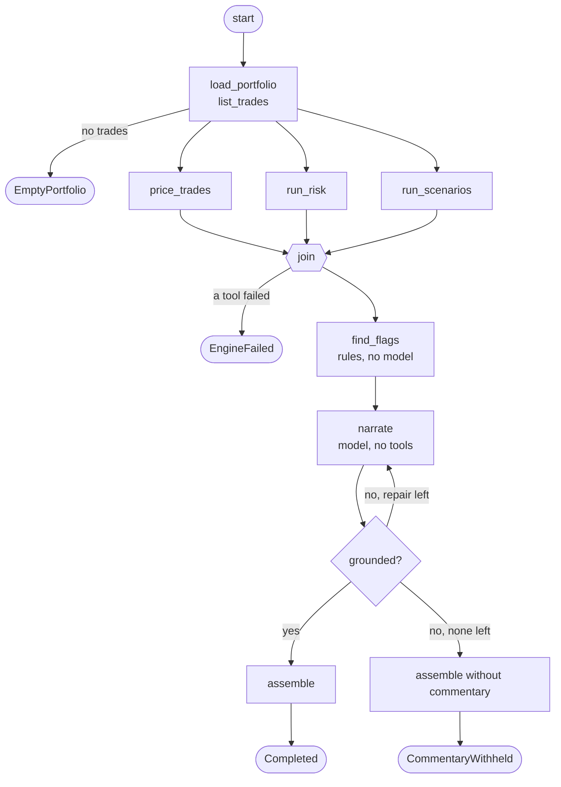

# Graph engineering plan

Goal: add one AI workflow whose control flow is an explicit graph, next to the Copilot's free loop, so the repository shows both and shows when each is the right choice.

## Status

Phases 1 to 5 are implemented. What was built, with a link to each file, is in [ai-engineering.md](ai-engineering.md#graph-engineering); the decisions are in [ADR 0002](adr/0002-graph-workflows.md). Where the build departed from this plan:

- A cycle is rejected at build time only when it has no way out. Whether a cycle with an exit ever takes it depends on the state, so that is bounded at run time by a step limit.
- `assemble` became two rule nodes, `accept_commentary` and `drop_commentary`, and the repair is its own node, so the diagram shows each decision.
- The brief works with no model provider configured: it returns the figures and says why there is no commentary.
- The save is offered when the request asks for it (`offerSave`), not by checking whether the scenario already exists, because the engine port cannot list saved scenarios.
- Book totals are sums taken by graph code. That is an exception to the letter of invariant 1 and is waiting for the owner's decision (ADR 0002, decision 4).
- The loop-versus-graph comparison was not measured. Against a scripted model the loop's call count is whatever the script says, so it would not be evidence; it needs the live model.
- A saved scenario does not outlive the request, because the API does not persist scenarios.

The rest of this page is the plan as written before the build.

## What graph engineering means here

Loop engineering gives the model the control flow: it decides which tool to call next and when to stop, and the harness bounds and checks it. Graph engineering takes the control flow back. The workflow is a directed graph written in code: nodes do one step each (a tool call, a model call, a deterministic check, a wait for a person), edges say what may follow, and a typed state object is the only thing passed between them. The model fills in nodes; it does not choose the path.

| | Loop (`CopilotAgent`) | Graph (this plan) |
|---|---|---|
| Who picks the next step | The model | The edges, from the state |
| Fits | Open questions, unknown number of steps | A known procedure that is run repeatedly |
| Model calls | Every step | Only in the nodes that need language |
| What can be tested offline | The harness around the model | The whole path, node by node |
| Failure looks like | Wrong tool, wandering, call limit | A node fails; the path to it is known |

This reading (agent orchestration as a graph) is the one that follows from the prompt, context and loop sections already in [ai-engineering.md](ai-engineering.md). Two other things share the name and are out of scope unless chosen in [Decisions needed](#decisions-needed): a dependency graph inside the pricing library (quote to curve to trade, for incremental recalculation), and a knowledge graph for retrieval.

## Principles

1. **The graph is data before it runs.** It is built, then validated, then executed. A graph with an unreachable node, a dead end or an unbounded cycle is rejected at build time, with a test showing each rejection.
2. **Deterministic by default.** A node uses the model only when the step needs language. Everything a tool or a rule can do is a code node.
3. **The five invariants hold without new exceptions.** Tools are reached through `ToolCatalog` and `ToolExecutor`, writes through `IApprovalGate`, model calls through `IModelClient`, and any model-written text passes `NumericGrounding` before it leaves.
4. **Every exit is a named status,** as in the loop. No path ends in an exception the caller did not cause.
5. **The diagram is generated from the code.** The picture in the docs and on the page is exported from the graph definition, and a test fails when they differ.

## The showcase: a portfolio risk brief

One request produces a short risk brief for the whole book: values, DV01 ladder, a fixed set of shocks, and a paragraph of commentary. The Copilot can already answer this as an open question, at the cost of a dozen model calls and a path that differs every time. As a graph it needs one model call, and the numbers in the tables never pass through the model at all.

| Node | Kind | Does |
|---|---|---|
| `load_portfolio` | Tool | `list_trades` |
| `price_trades`, `run_risk`, `run_scenarios` | Tool, fan-out | One call per trade (and per shock), run concurrently, joined before the next node |
| `find_flags` | Rule | Picks what is worth saying: largest DV01, most concentrated bucket, worst shock. Plain code over engine results |
| `narrate` | Model | Receives the engine results and the flags as JSON in the user turn; writes prose. Has no tools. Its system prompt is a static embedded file |
| `check` | Guard | `NumericGrounding` against the tool results gathered in the state. One repair, then the commentary is dropped and the tables are returned alone |
| `assemble` | Rule | Builds the response from engine results (tables) and the checked text |

Phase 4 adds a branch that shows a human in the graph: after `assemble`, if the worst shock is not already saved, the run pauses at an `await_approval` node, returns its checkpoint id, and resumes into `save_scenario` only when a person approves. The API has no approval path today (`CopilotService` uses `DenyAllApprovalGate`), so this would be the first one.

## Design

**Runtime**, a new project `src/CurveRisk.Workflows`, about 300 lines, no dependency on the Copilot or on any SDK:

| Type | Responsibility |
|---|---|
| `IGraphNode<TState>` | `Task<TState> RunAsync(TState, CancellationToken)`. State is an immutable record; a node returns a new one |
| `GraphBuilder<TState>` | Adds nodes, edges, conditional edges, fan-out with a join and a merge function; `Build()` validates |
| `GraphDefinition<TState>` | The validated, immutable graph. `ToMermaid()` exports it |
| `GraphRunner<TState>` | Executes with a step limit, one telemetry span per node, cancellation, and a `GraphRun` result: final state, named outcome, and the trace (node, outcome, duration) |
| `ICheckpointStore` (Phase 4) | Saves state at an interrupt so a run can resume in a later request |

**The brief**, in `src/CurveRisk.Copilot/Briefs/`: `RiskBriefState`, one small class per node, `RiskBriefGraph.Create(...)`, and `Prompts/brief.md`. It reuses `ToolExecutor`, `IModelClient`, `NumericGrounding`, `BudgetGuard` and `CopilotTelemetry` unchanged.

**Hand-written or a framework.** Recommended: hand-written, for the reason `CopilotAgent` gives for its loop: the guarantees live inside the control flow, and a small runtime can be read and tested in full. The alternative is the workflow API of Microsoft Agent Framework, which brings checkpointing and visualisation but a larger dependency and its own model abstractions beside `IModelClient`. An ADR records the choice.

**API and page.** `POST /api/v1/risk-briefs` (through the `add-endpoint` skill) returns the tables, the commentary, the status and the trace. The page gets a "Risk brief" panel that draws the graph and marks each node from the trace as it ran, was skipped or failed. Text is set with `textContent` only.

## Phases

| Phase | Deliverable | Exit | Effort |
|---|---|---|---|
| 1. Runtime | `CurveRisk.Workflows`: builder, validation, runner, trace, Mermaid export. ADR 0002 | Tests for routing, fan-out and join, step limit, cancellation, a throwing node, and one test per validation rule showing it can fail. Architecture test: the project references nothing but the base library | 1.5 days |
| 2. The brief graph | State, nodes, prompt, `RiskBriefGraph` | Whole graph runs against `ScriptedModelClient`: grounded, repaired, withheld, empty portfolio, engine failure, budget exhausted. Path assertions on the trace. `quant-reviewer` is not needed (no pricing code); `guardrail-reviewer` pass | 2 days |
| 3. API and page | Endpoint, service, contract records, panel with the live diagram | `ApiFactory` tests for the happy path and each documented error; page clicked through in the browser; `api-contract-guardian` pass | 1.5 days |
| 4. Human in the graph | `await_approval` interrupt, checkpoint store, `POST /api/v1/risk-briefs/{id}/approval`, resume | Tests: no approval means no write; approval resumes from the checkpoint and not from the start; a second approval of the same run is refused. `security-reviewer` pass | 2 days |
| 5. Evidence and write-up | Diagram drift test; a "Graph engineering" section and capability-map row in `ai-engineering.md`; a loop-versus-graph comparison on the same request (model calls, tokens, cost) measured against the scripted model, and against the live model once a key exists | `node tools/check.mjs` green; figures in the write-up come from a run, not an estimate | 1 day |

Phases 1 to 3 are the minimum that shows the idea. Phase 4 is the part most worth having after that, because a pause-and-resume approval is something a loop does badly and a graph does naturally.

Stretch, not planned in detail: a router node in front (a small model classifies the request, then routes to the brief graph or the free loop, which is the model routing item in [PLAN.md](../PLAN.md)); and the same runtime idea on the development side, a review graph that routes a diff to the reviewer subagents by path and joins their findings.

## Limits and costs

- The eval dataset is protected from agent edits. Graph behaviour is covered by offline tests in this plan; live eval cases for the brief have to be added by a person.
- Coverage thresholds apply to the new project from the first commit, so each phase carries its tests.
- A graph is rigid on purpose. A request that does not fit the brief still goes to the Copilot loop; the write-up should say so and not present the graph as a replacement.
- Phase 4's checkpoint store is in memory. A durable one waits for the migrations work.
- Until an API key exists, the `narrate` node has only run against the scripted model, and the comparison in Phase 5 has no live figures.

## Decisions needed

1. **The meaning.** This plan takes graph engineering as agent orchestration. Say so if you meant the pricing dependency graph or a knowledge graph instead.
2. **Hand-written runtime or Microsoft Agent Framework workflows.** Recommended: hand-written.
3. **Where the runtime lives.** Recommended: its own project, so an architecture test can keep it free of AI dependencies. Alternative: a folder in `CurveRisk.Copilot`.
4. **Whether Phase 4 is in the first delivery.** Recommended: yes, after Phases 1 to 3 are merged.
5. **The showcase workflow.** Recommended: the risk brief. Alternative: "explain a P&L move" between two market snapshots, which is a better story but needs snapshot comparison the engine port does not yet offer.
